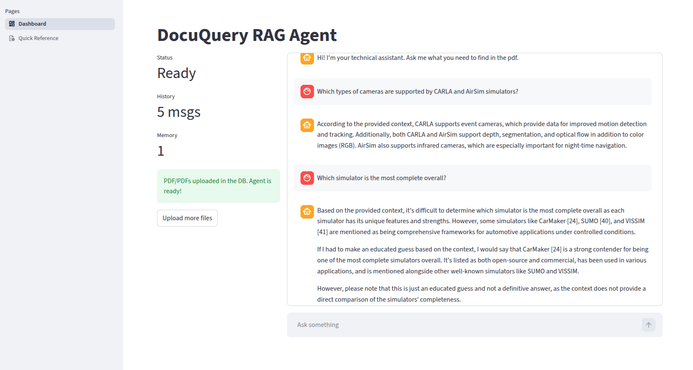
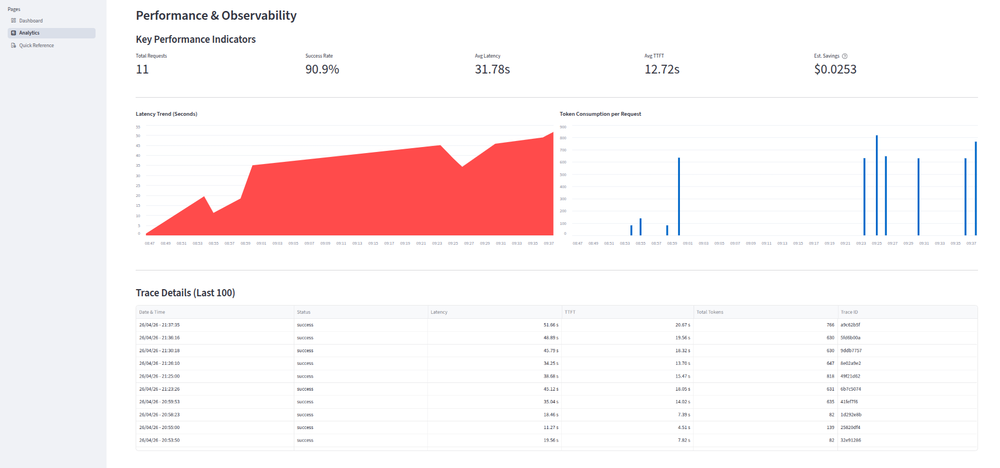
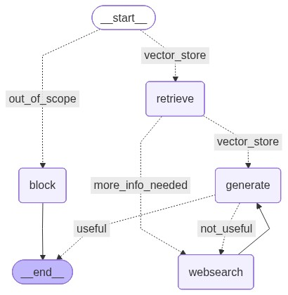

# DocuQuery RAG Agent


An on-premise RAG agentic system designed to process and query technical documentation (PDFs). 

This project runs entirely locally using open-source LLMs. It features a microservices architecture decoupling the frontend, the API layer, and the AI reasoning engine.

## User Interface


 

## Architecture Stack

The system is fully containerized and divided into three main microservices:

* **Frontend (Streamlit):** A reactive, chat-based UI. Features dynamic state management, real-time metrics, and document ingestion.
* **Backend API (FastAPI):** Handles routing, input/output validation via Pydantic, and file uploads.
* **AI Engine (LangChain & Ollama):** 
    * **LLM:** `Llama 3.1 (8B)` via Ollama for local reasoning.
    * **Embeddings:** `nomic-embed-text` for semantic search.
    * **Vector DB:** `ChromaDB` for persistent local storage of chunked data.

## Agent Workflow



## Core Features (What's working right now)
The project has recently evolved from a linear pipeline into an Agentic application. Current capabilities include:

* **Stateful Agentic RAG:** Powered by LangGraph, replacing linear chains with a cyclical graph architecture capable of maintaining conversational state and memory.
* **Semantic Query Routing (Guardrails):** The agent dynamically classifies user intent. It intelligently routes technical queries to the Vector DB while instantly blocking out-of-scope questions, reducing latency and token usage.
* **Self-Reflective Loop (CRAG):** The agent utilizes an internal "grader" node to evaluate its own retrieved documents and generated answers. If it detects a hallucination or poor context, it rejects the answer and tries again.
* **Web Search Fallback:** If the local document database does not contain the answer, the agent autonomously falls back to querying the web (via DuckDuckGo) to augment its context.
* **Multi-Document Ingestion:** The backend handles multiple PDFs simultaneously, using IDs (preventing vector duplication in ChromaDB).
* **API Backend:** FastAPI handles document chunking, embedding, and chat routing with robust error handling and telemetry control.

## Roadmap & Next Steps
The next phase focuses on performance optimization and advanced UX:

* **Token Streaming:** Implement token-by-token generation in the FastAPI backend and Streamlit UI for a faster, ChatGPT-like user experience.
* **Source Citations:** Enhance the agent's output to explicitly cite the source document name, web link, or page number it used to generate the answer.
* **Incremental Summarization:** Add a node to summarize the `chat_history` when it gets too long, keeping the LLM prompt within context limits while preserving long-term memory.

## Quick Start

1. **Clone the repository:**
    ```bash
    git clone https://github.com/matteoespo/docuquery-rag-agent.git
    cd docuquery-rag-agent
    ```

2. **Deploy the stack with Docker**

    ```bash
    docker-compose up -d --build
    ```

3. **Pull the local models**

    *Run inside the Ollama container:*

    ```bash
    docker exec -it docuquery-rag-ollama ollama pull llama3.1
    docker exec -it docuquery-rag-ollama ollama pull nomic-embed-text
    ```

## Access the Application

* **Web UI:** Navigate to http://localhost:8501 to upload a pdf and start chatting.
* **API Docs:** Navigate to http://localhost:8000/docs to test endpoints via Swagger UI.
