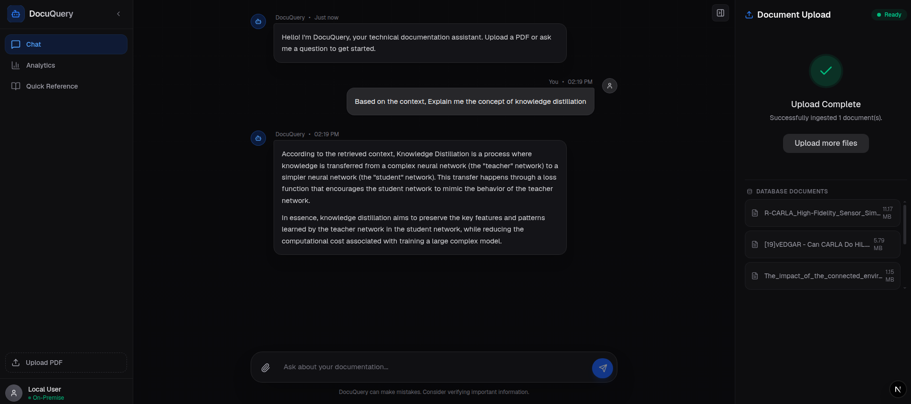
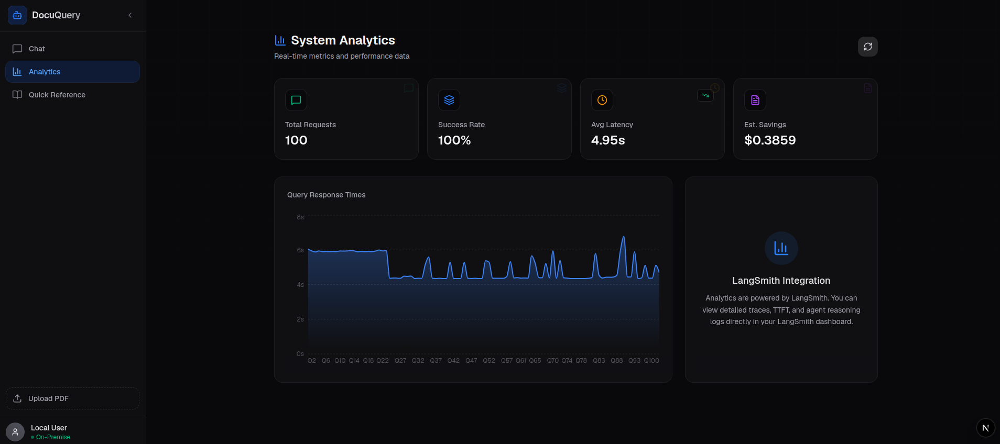
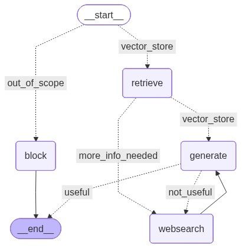

# 🚀 DocuQuery RAG Agent

<div align="center">
  


</div>

<br/>

---

**DocuQuery RAG Agent** is an on-premise Retrieval-Augmented Generation (RAG) system designed to process and query technical documentation (like PDFs) with precision.

This project runs entirely locally using open-source LLMs.

## User Interface




## Architecture Stack

The system is fully containerized and divided into three main microservices:

* **Frontend (Next.js):** Reactive chat-based UI built with Next.js 16, TailwindCSS v4, and Framer Motion. Features dynamic state management via Zustand, real-time metrics, and document ingestion.
* **Backend API (FastAPI):** Handles routing, input/output validation via Pydantic, and file uploads.
* **AI Engine (LangChain & Ollama):** 
    * **LLM:** `Llama 3.2 (3B)` via Ollama for local reasoning.
    * **Vision LLM:** `Moondream (1.8B)` via Ollama for image captioning.
    * **Embeddings:** `nomic-embed-text` for semantic search.
    * **Vector DB:** `ChromaDB` for persistent local storage of chunked data.

## Agent Workflow



## Core Features (What's working right now)
The project has recently evolved from a linear pipeline into an Agentic application. Current capabilities include:

* **Stateful Agentic RAG:** Powered by LangGraph, replacing linear chains with a cyclical graph architecture capable of maintaining conversational state and memory.
* **Semantic Query Routing (Guardrails):** The agent dynamically classifies user intent. It intelligently routes technical queries to the Vector DB while instantly blocking out-of-scope questions, reducing latency and token usage.
* **Self-Reflective Loop (CRAG):** The agent utilizes an internal "grader" node to evaluate its own retrieved documents and generated answers. If it detects a hallucination or poor context, it rejects the answer and tries again.
* **Web Search Fallback:** If the local document database does not contain the answer, the agent autonomously falls back to querying the web (via DuckDuckGo) to augment its context.
* **Multimodal Ingestion:** Handles multiple PDFs simultaneously. Extracts tabular data as Markdown (via `pdfplumber`) and parses diagrams/images into searchable text using a Vision LLM (`moondream` via `PyMuPDF`).
* **API Backend:** FastAPI handles document chunking, embedding, and chat routing with robust error handling and telemetry control.
* **Adaptive Long-Term Memory:** A sliding-window memory approach that preserves the last three messages verbatim for immediate context, while utilizing an LLM-driven summarization chain to compress older interactions into concise bullet points, ensuring long-term continuity without exceeding token limits.
* **Token Streaming:** Token-by-token generation in the FastAPI backend and Next.js UI for a faster user experience.

## Roadmap & Next Steps
The next phase focuses on performance optimization and advanced UX:

* **Source Citations:** Enhance the agent's output to explicitly cite the source document name, web link, or page number it used to generate the answer.

## Quick Start

### Prerequisites
* **Docker & Docker Compose** installed.
* **NVIDIA Container Toolkit** installed (if using Linux/WSL) to enable GPU passthrough for the Ollama container.

1. **Clone the repository:**
    ```bash
    git clone https://github.com/matteoespo/docuquery-rag-agent.git
    cd docuquery-rag-agent
    ```

2. **Configure Environment Variables:**
    Copy the example environment file and fill in your keys (especially your `LANGSMITH_API_KEY` for telemetry):
    ```bash
    cp .env.example .env
    ```

3. **Deploy the stack with Docker:**
    ```bash
    docker-compose up -d --build
    ```

4. **Pull the local models:**
    *Run inside the Ollama container:*
    ```bash
    docker exec -it docuquery-rag-ollama ollama pull llama3.2:3b
    docker exec -it docuquery-rag-ollama ollama pull moondream
    docker exec -it docuquery-rag-ollama ollama pull nomic-embed-text
    ```

## Access the Application

* **Web UI:** Navigate to http://localhost:3000 to upload a pdf and start chatting.
* **API Docs:** Navigate to http://localhost:8000/docs to test endpoints via Swagger UI.
